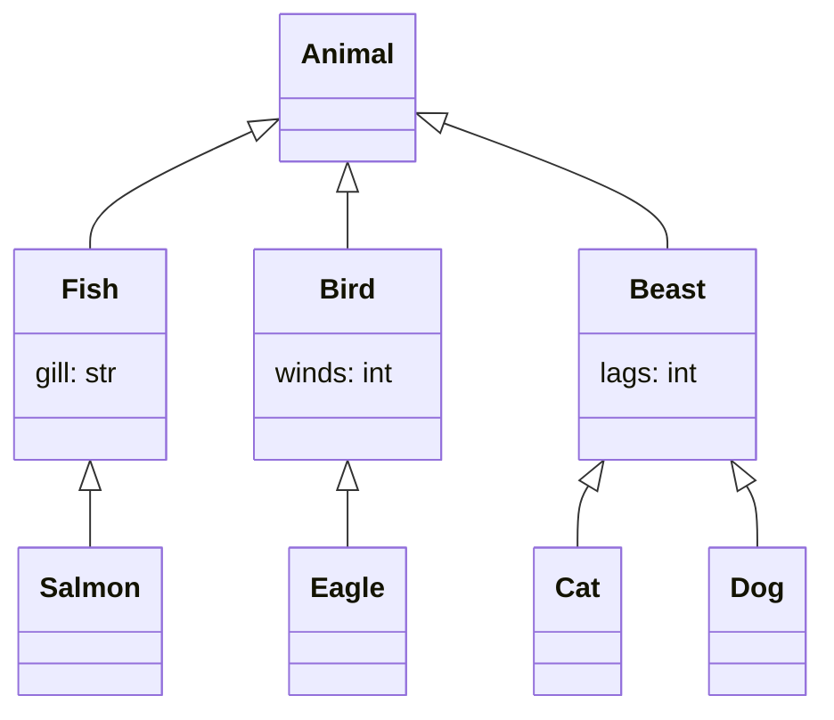
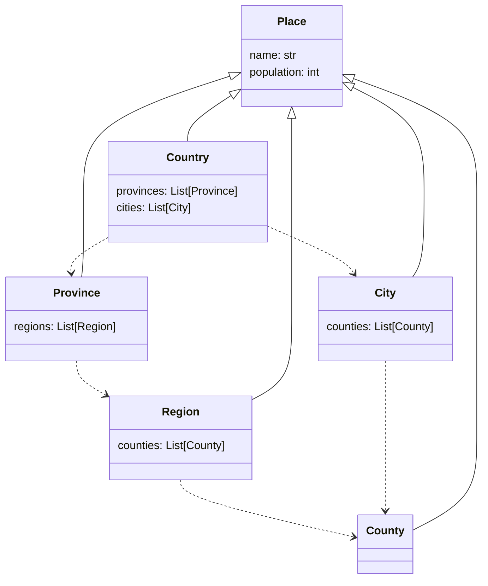

# Pydantic Mermaid
To convert Pydantic models to Mermaid charts, you can use the `pydantic-mermaid` library. This library allows you to generate Mermaid charts from your Pydantic models. Here are the steps to install and use pydantic-mermaid:

# Use in terminal

Install the `pydantic-mermaid` library using pip:

```bash
pip install pydantic-mermaid
```

Use command line
```bash
python -m pydantic-mermaid --module models.py --output models.md
```

# Use in code

1. Import your Pydantic models into your Python script.
2. Create an instance of the MermaidGenerator class from the `pydantic-mermaid` module and pass in your Pydantic models as arguments.

```python
from pydantic_mermaid import MermaidGenerator

import my_module

generator = MermaidGenerator(my_module)
```

3. Call the generate_chart() method of the MermaidGenerator instance to generate the Mermaid chart.

```python
chart = generator.generate_chart()
```

4. Use the chart variable to display or save the Mermaid chart.
```python
print(chart)
```

This will print the Mermaid chart as a string. You can also save the chart to a file by writing the chart string to a file:

```python
with open("chart.mmd", "w") as f:
    f.write(chart)
```

This will save the Mermaid chart to a file called chart.mmd. You can then use a tool like the Mermaid Live Editor to visualize and edit the chart.

# examples

Inheritance: 



dependencies:



For details, check examples/ folder.