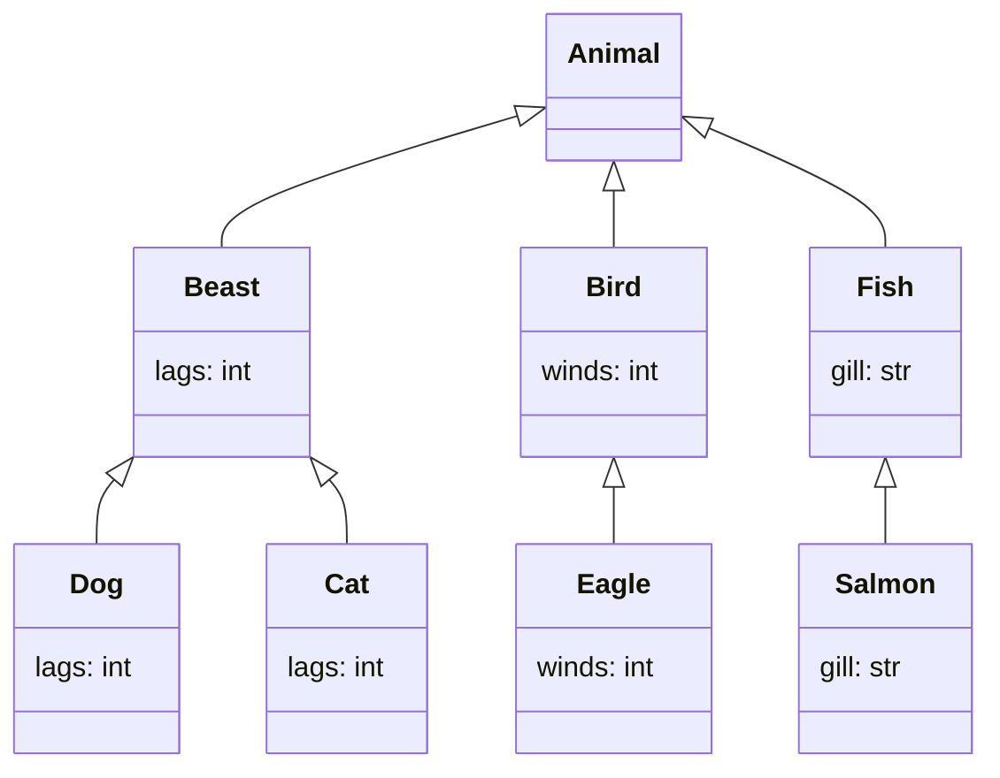
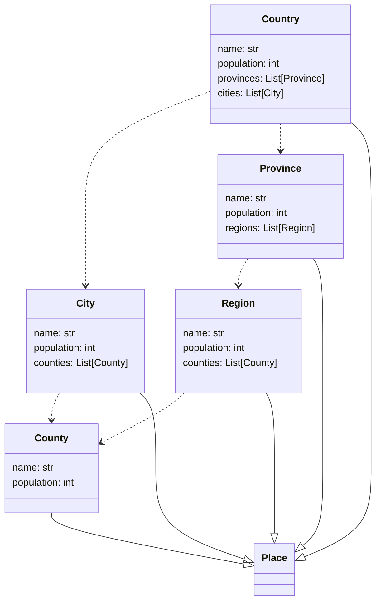

To convert Pydantic models to Mermaid charts, you can use the pydantic-mermaid library. This library allows you to generate Mermaid charts from your Pydantic models. Here are the steps to install and use pydantic-mermaid:

1. Install the pydantic-mermaid library using pip:

```bash
pip install pydantic-mermaid
```

2. Import your Pydantic models into your Python script.
3. Create an instance of the MermaidGenerator class from the pydantic_mermaid module and pass in your Pydantic models as arguments.

```python
from pydantic_mermaid import MermaidGenerator
from my_module import MyPydanticModel

generator = MermaidGenerator(MyPydanticModel)
```

4. Call the generate_chart() method of the MermaidGenerator instance to generate the Mermaid chart.

```python
chart = generator.generate_chart()
```

5. Use the chart variable to display or save the Mermaid chart.
```python
print(chart)
```

This will print the Mermaid chart as a string. You can also save the chart to a file by writing the chart string to a file:

```python
with open("chart.mmd", "w") as f:
    f.write(chart)
```

This will save the Mermaid chart to a file called chart.mmd. You can then use a tool like the Mermaid Live Editor to visualize and edit the chart.

# examples

Inheritance: 



dependencies:



For details, check examples/ folder.