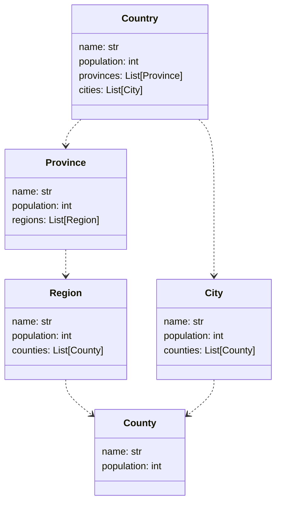

```mermaid
classDiagram
    class County {
        name: str
        population: int
    }

    class Region {
        name: str
        population: int
        counties: List[County]
    }

    class Province {
        name: str
        population: int
        regions: List[Region]
    }

    class City {
        name: str
        population: int
        counties: List[County]
    }

    class Country {
        name: str
        population: int
        provinces: List[Province]
        cities: List[City]
    }


    Region ..> County
    Province ..> Region
    City ..> County
    Country ..> Province
    Country ..> City

```