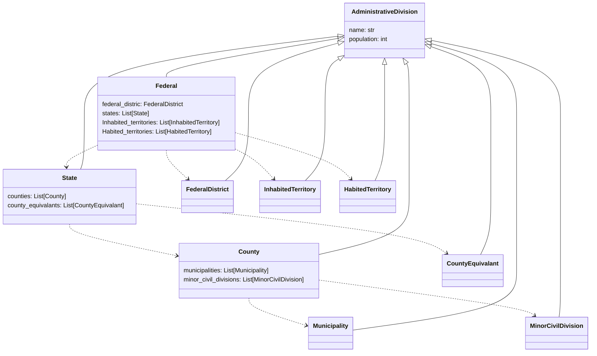

```mermaid
classDiagram
    class AdministrativeDivision {
        name: str
        population: int
    }

    class Municipality {
    }

    class MinorCivilDivision {
    }

    class County {
        municipalities: List[Municipality]
        minor_civil_divisions: List[MinorCivilDivision]
    }

    class CountyEquivalant {
    }

    class State {
        counties: List[County]
        county_equivalants: List[CountyEquivalant]
    }

    class FederalDistrict {
    }

    class InhabitedTerritory {
    }

    class HabitedTerritory {
    }

    class Federal {
        federal_distric: FederalDistrict
        states: List[State]
        Inhabited_territories: List[InhabitedTerritory]
        Habited_territories: List[HabitedTerritory]
    }


    County ..> Municipality
    County ..> MinorCivilDivision
    State ..> CountyEquivalant
    State ..> County
    Federal ..> FederalDistrict
    Federal ..> State
    Federal ..> InhabitedTerritory
    Federal ..> HabitedTerritory

    AdministrativeDivision <|-- FederalDistrict
    AdministrativeDivision <|-- County
    AdministrativeDivision <|-- InhabitedTerritory
    AdministrativeDivision <|-- MinorCivilDivision
    AdministrativeDivision <|-- CountyEquivalant
    AdministrativeDivision <|-- HabitedTerritory
    AdministrativeDivision <|-- Municipality
    AdministrativeDivision <|-- State
    AdministrativeDivision <|-- Federal
```