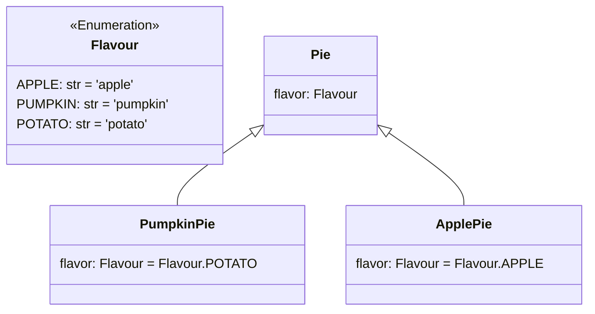

```mermaid
classDiagram

    class Flavour {
        <<Enumeration>>
        APPLE: str = 'apple'
        PUMPKIN: str = 'pumpkin'
        POTATO: str = 'potato'
    }

    class Pie {
        flavor: Flavour
    }

    class ApplePie {
        flavor: Flavour = Flavour.APPLE
    }

    class PumpkinPie {
        flavor: Flavour = Flavour.POTATO
    }


    Pie <|-- PumpkinPie
    Pie <|-- ApplePie

```