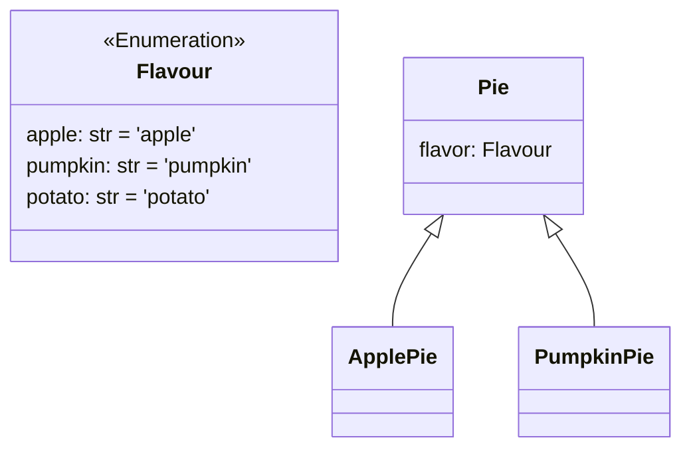

```mermaid
classDiagram
    class Flavour {
        <<Enumeration>>
        apple: str = 'apple'
        pumpkin: str = 'pumpkin'
        potato: str = 'potato'
    }

    class Pie {
        flavor: Flavour
    }

    class ApplePie {
    }

    class PumpkinPie {
    }


    Pie <|-- ApplePie
    Pie <|-- PumpkinPie
```