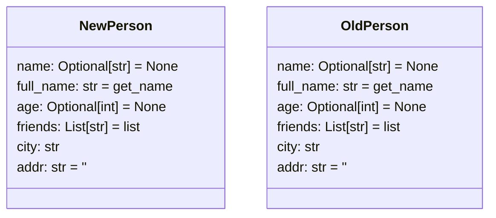

```mermaid
classDiagram

    class NewPerson {
        name: Optional[str] = None
        full_name: str = get_name
        age: Optional[int] = None
        friends: List[str] = list
        city: str
        addr: str = ''
    }

    class OldPerson {
        name: Optional[str] = None
        full_name: str = get_name
        age: Optional[int] = None
        friends: List[str] = list
        city: str
        addr: str = ''
    }


```